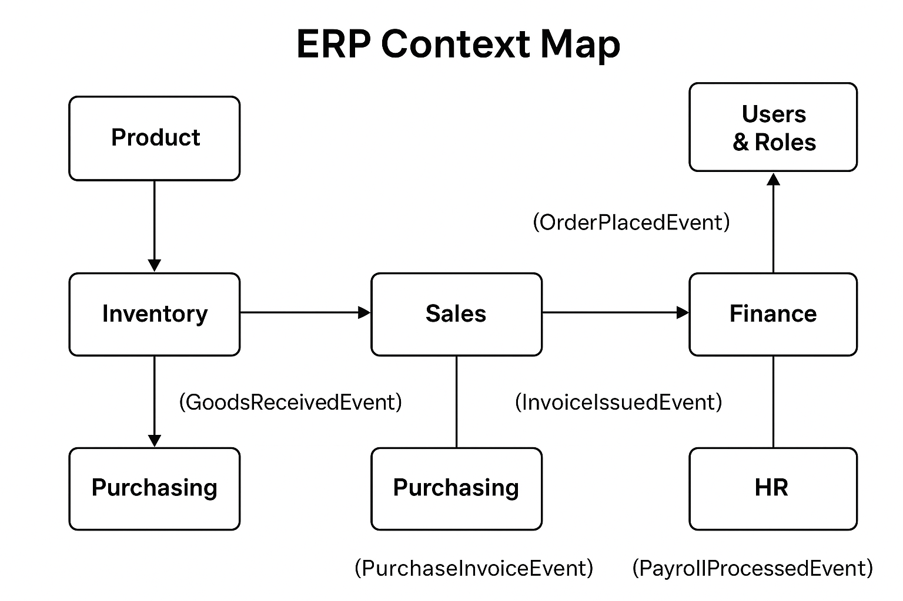

# MiniERP - Sales and Inventory Management System

A professional-grade mini ERP system developed with **Spring Boot** for managing products, sales, inventory, and user access. This project is designed to showcase advanced Java backend skills, clean architecture, and real-world production practices.

## 🚀 Features

- ✅ JWT Authentication & Authorization
- ✅ Role-based Access Control (RBAC)
- ✅ Product & Order Management
- ✅ Spring Security
- ✅ MySQL Integration with Spring Data JPA
- ✅ Input Validation (Bean Validation)
- ✅ Swagger (OpenAPI) API Documentation
- ✅ Actuator Monitoring
- ✅ Event Publishing (Domain Events)
- ✅ Export Products to Excel (admin only)
- ✅ Caching with Spring Cache
- ✅ Dockerized Build & Runtime
- ✅ CI/CD with GitHub Actions

## 🧱 Tech Stack

- **Spring Boot 3.5**
- **Java 17**
- **Spring Security + JWT**
- **Spring Data JPA + MySQL**
- **Spring Cache**
- **Spring Validation**
- **Springdoc OpenAPI**
- **Apache POI** (Excel export)
- **Docker**
- **GitHub Actions**

## 🗂️ Project Structure

```

src/
├── application
├── domain
├── infrastructure
├── interfaces

````

## 🔐 Authentication & Roles

- JWT-based login system
- `ADMIN`, `USER`, and `MANAGER` roles
- Access restrictions on endpoints via annotations

## 📦 Docker

To build and run the project in Docker:

```bash
docker build -t minierp-app .
docker run -p 8080:8080 minierp-app
````

## ⚙️ GitHub Actions

Automatic CI pipeline:

* Maven clean build
* Test execution
* Docker build
* Push to Docker Hub (if configured)

## 📊 API Documentation

Open `http://localhost:8080/swagger-ui.html` or `/swagger-ui/index.html` for Swagger UI.

## 📁 Excel Export

Admins can export all products as `.xlsx` via a secure endpoint.

## 🧠 Caching

Product listing and detail APIs are cached using Spring's annotation-based caching (`@Cacheable`) to boost performance.

## 🧪 Testing (WIP)

* Unit And Integration tests using JUnit 5

The project includes both **unit** and **integration** tests.

- **AuthServiceTest** (unit):
    - Tests registration logic, duplicate username validation, login validation, and JWT generation.
    - Uses Mockito for mocking and AssertJ for fluent assertions.

- **AuthControllerIntegrationTest** (integration):
    - Tests actual HTTP endpoints (`/api/auth/register`, `/api/auth/login`) using MockMvc.
    - Runs with in-memory H2 database and full Spring context.

Run all tests:
```bash
mvn test
```
## 👨‍💻 Author

**Fateme Soleymanian**
[LinkedIn](https://www.linkedin.com/in/fateme-soleymanian-b2713a225) • [GitHub](https://github.com/fatemesoleymanian) • [Portfolio](https://dark-cake-0993.on.fleek.co/)

---

## 🪪 License
This project is licensed under a custom license.  
It is shared for **demonstration and educational purposes only**.  
Commercial use or distribution without permission is prohibited.

مجوز:
این پروژه صرفاً برای نمایش و اهداف آموزشی منتشر شده است.
استفاده تجاری یا انتشار بدون اجازه نویسنده ممنوع است.

---

> ⭐ If you like this project or find it useful, give it a star on GitHub!
