# MiniERP - Modular Sales & Inventory System

A professional-grade, modular ERP system built with **Spring Boot 17** and **Spring Boot 3.5**.  
This project demonstrates a clean, domain-driven approach to managing products, sales, inventory, and security for a modern web application.  
It is built to showcase advanced backend development skills, including event-driven design, robust security, and production-ready practices.

## Architecture Diagram

Here is a high-level overview of the MiniERP system architecture:

```mermaid
graph TD
    subgraph "Clients"
        UI[💻 User Interface / Postman]
    end

    subgraph "MiniERP API (Spring Boot)"
        direction TB
        Sec[🛡️ Spring Security / JWT]
        Ctrl(📲 REST Controllers)
        
        subgraph "Application Layer"
            direction TB
            PSvc[ProductService]
            OSvc[OrderService]
            ISvc[InventoryService]
            USvc[UserService]
        end

        subgraph "Domain Layer"
            direction TB
            PEnt[Product Entity]
            OEnt[Order Entity]
            IEnt[Inventory Entity]
            Evt(🔥 DomainEventPublisher)
        end
        
        subgraph "Infrastructure Layer"
            direction TB
            JPA(🗃️ Repositories / JPA)
            Cache(⚡ Spring Cache)
            Utils(🛠️ Excel/PDF Utils)
        end
    end

    subgraph "External Systems"
        direction TB
        DB[(💾 MySQL Database)]
    end

    UI --> Sec
    Sec --> Ctrl
    
    Ctrl --> PSvc
    Ctrl --> OSvc
    Ctrl --> ISvc
    Ctrl --> USvc
    
    PSvc --> Evt
    PSvc --> JPA
    
    OSvc --> Evt
    OSvc --> JPA
    OSvc --> ISvc

    ISvc --> JPA
    
    JPA --> DB
    PSvc --> Cache
    
```   


---

## 🚀 Core Features

- **Secure API:** Robust authentication with JWT (Login, Register, Refresh) and fine-grained, role-based authorization using Spring Security's `@PreAuthorize` annotations (e.g., `ADMIN`, `INVENTORY_MANAGER`, `SALES` roles).
- **Modular, Domain-Driven Design:** Code is logically separated into modules (Product, Customer, Order, Inventory, Report) with a clean separation of concerns.
- **Event-Driven Architecture:** Uses Spring's `@EventListener` and a custom `DomainEventPublisher` to decouple modules.  
  For example, `ProductCreatedEvent` is published on new product creation, allowing other modules (like Inventory) to react without tight coupling.
- **Advanced JPA & Auditing:** Leverages Spring Data JPA with a custom `AuditableEntity` base class for automatic tracking of `createdAt`, `createdBy`, `updatedAt`, and `lastModifiedBy`.
- **Soft Deletes:** Implements a non-invasive soft-delete pattern across all entities using Hibernate's `@Where(clause = "deleted_at IS NULL")`, keeping data intact while hiding it from all queries.
- **Concurrency-Safe:** Uses `@Version` (Optimistic Locking) on critical entities to prevent concurrent modification conflicts.
- **Dynamic Reporting:** Secure (admin-only) export of product data to `.xlsx` files using Apache POI and PDF generation (for invoices, etc.) using OpenPDF.
- **Robust Validation:** Comprehensive DTO-level request validation using `jakarta.validation.constraints` (e.g., `@NotBlank`, `@Size`, `@DecimalMin`).
- **Live API Documentation:** Automatically generated and interactive API documentation via **Springdoc-OpenAPI** (available at `/swagger-ui.html`).
- **Performance Optimized:** Utilizes **Spring Cache** (`@Cacheable`) on high-read, low-write endpoints to reduce database load.
- **Containerized:** Fully Dockerized with a multi-stage Dockerfile for a lightweight, production-ready image.
- **CI/CD Pipeline:** Includes a **GitHub Actions** workflow for continuous integration, running tests and building the Docker image on every push.

---

## 🧱 Tech Stack

| Category | Technology |
|-----------|-------------|
| **Backend** | Spring Boot 3.5.4, Spring Web, Spring Data JPA |
| **Security** | Spring Security 6, JWT (jjwt) |
| **Database** | MySQL, Hibernate, Spring Cache (Simple) |
| **Tooling** | Java 17, Maven, Lombok |
| **API & Docs** | Springdoc-OpenAPI (Swagger 3) |
| **Reporting** | Apache POI (Excel), OpenPDF (PDF) |
| **DevOps** | Docker, GitHub Actions |

---

## 🗂️ Project Structure

This project follows a clean, modular architecture inspired by **Domain-Driven Design (DDD)** and **Hexagonal Architecture**.

```

src/main/java/com/example/minierp/
├── application    # Service layer: orchestrates business logic (e.g., ProductService)
├── domain         # Core business: entities, repositories, events (e.g., Product, ProductCreatedEvent)
├── infrastructure # External concerns: DB configuration, security, event implementation
└── interfaces     # Entry points: REST controllers, DTOs (e.g., ProductController, CreateProductRequest)

````

This structure ensures that the core domain logic is independent of application logic and external infrastructure, making the system easier to test, maintain, and evolve.

---

## ⚙️ Getting Started

### Prerequisites

- Java 17 (JDK)  
- Apache Maven  
- MySQL Server  
- Docker (Optional, for containerized build)

---

### 1. Database Setup

Create a new MySQL database:

```sql
CREATE DATABASE mini_erp;
````

Update the database credentials in `src/main/resources/application.properties`:

```properties
spring.datasource.url=jdbc:mysql://localhost:3306/mini_erp
spring.datasource.username=YOUR_USERNAME
spring.datasource.password=YOUR_PASSWORD
```

---

### 2. Run the Application

**From your IDE (e.g., IntelliJ / VSCode):**
Simply run the `MiniErpApplication.java` file.

**Using Maven:**

```bash
mvn spring-boot:run
```

The application will be available at:
👉 [http://localhost:8080](http://localhost:8080)

---

## 📦 Docker

You can easily build and run the project using Docker.

**Build the Docker image:**

```bash
docker build -t minierp-app .
```

**Run the Docker container:**
(Remember to pass in your database environment variables)

```bash
docker run -p 8080:8080 \
   -e DB_URL=jdbc:mysql://YOUR_DB_HOST/mini_erp \
   -e DB_USERNAME=YOUR_USERNAME \
   -e DB_PASSWORD=YOUR_PASSWORD \
   minierp-app
```

---

## 📊 API Documentation

Once the application is running, you can explore the complete, interactive API documentation (powered by Swagger) at:
👉 [http://localhost:8080/swagger-ui.html](http://localhost:8080/swagger-ui.html)

---

## 🧪 Testing

The project includes both unit and integration tests to ensure code quality and correctness.

* **Unit Tests:** Use **JUnit 5** and **Mockito** to test services and business logic in isolation (e.g., `AuthServiceTest`).
* **Integration Tests:** Use **MockMvc** and `@SpringBootTest` to test the full Spring context, from the controller layer down to the database (e.g., `AuthControllerIntegrationTest`).

**Run all tests:**

```bash
mvn test
```

---

## 👨‍💻 Author

**Fateme Soleymanian**
[LinkedIn]() • [GitHub]() • [Portfolio]()

---

## 🪪 License

```
Copyright (c) 2025
Fateme Soleymanian
All Rights Reserved.

This project is published for demonstration and educational purposes only.
You are not allowed to copy, modify, distribute, or use it commercially
without explicit written permission from the author.
```

For collaboration or commercial inquiries, please contact the author.

---

⭐ **If you like this project or find it useful, please give it a star!**
